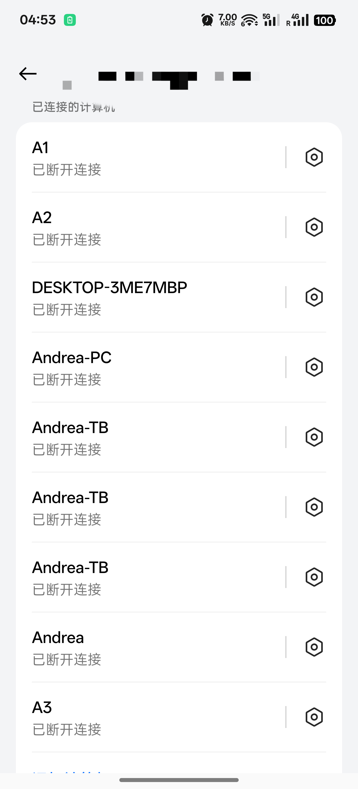
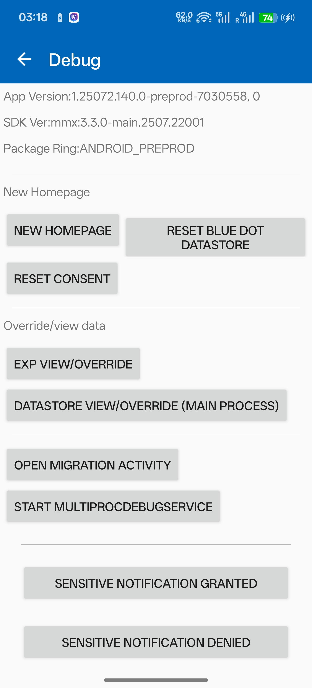
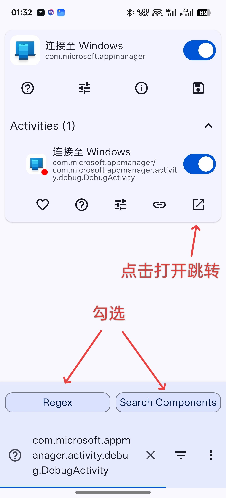
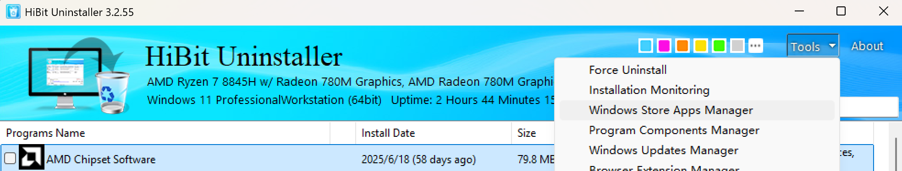
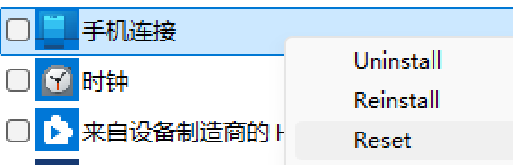
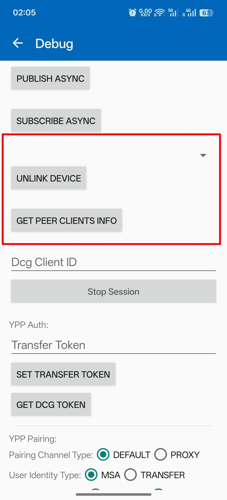
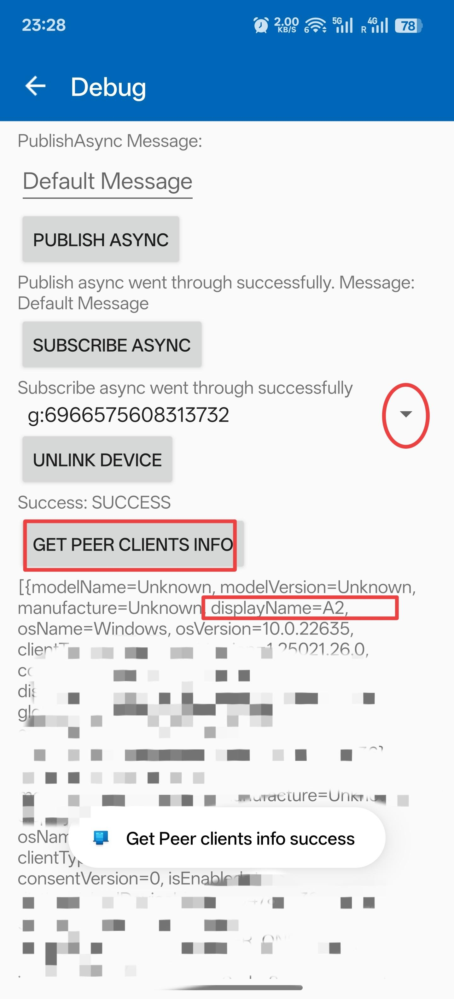
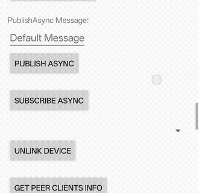
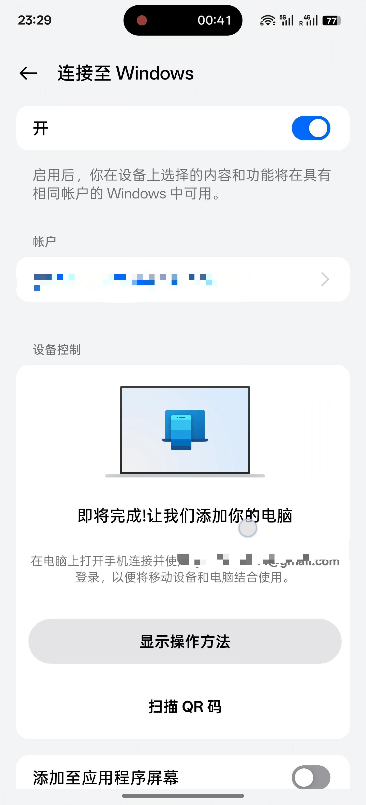

[中文 (简体) ← 点击查看](README.zh-CN.md)

# Remove-old-device-from-Microsoft-Phone-Link-on-Android
Remove old device from Microsoft Phone Link on Android

As we all know, Windows Phone Link has always had the issue of not being able to delete old devices. Not long ago, Microsoft finally added a "Delete" button to the Phone Link on PC through an update, but they seem to have deliberately overlooked the Android side. Even now, some users (myself included) still have a bunch of "ghost" devices in their device list.

As a ROOT user, I enjoy tinkering, but I hate Microsoft, which triggers my OCD! So I discovered the Debug page of Phone Link through the Activity Launcher.

And this page contains a solution to the "ghost" devices issue!
It's a complete fix, and the problem won't reappear after logging back into your Microsoft account!

First, make sure the version numbers of Phone Link are aligned on both mobile and PC to prevent UI changes.

The version numbers corresponding to this tutorial are:

Phone Link on mobile: 1.25072.140.0-beta(7030558) - Google Play

Phone Link on PC: 1.25072.51.0

Mobile devices on PC: 1.25072.47.0

①Root users can directly use the Activity launcher I provide below (requires Root) to directly open the Debug activity.

②For non-Root users：Since Microsoft declared the exported attribute of the Debug Activity as false in the AndroidManifest.xml of Phone Link, it is not possible to directly open the Activity without Root privileges. Moreover, Microsoft did not leave an entry point for the Debug page in the official UI (or maybe I just haven't found it; if any experts have time, you can reverse-engineer it). Therefore, we need to use Shizuku and an Activity launcher that supports Shizuku.

Shizuku: https://shizuku.rikka.app/

Activity launcher: https://appteka.store/app/17er175390

First, install Shizuku and activate it by following the in-app instructions (not elaborated here).
Then install rootactivitylauncher; when you launch it for the first time, it will automatically prompt you to activate Shizuku.
Then, as shown in the picture, search for 

`com.microsoft.appmanager.activity.debug.DebugActivity`

You can open the Debug page without root access.

--------------------------------------------------------------------------

①Let’s look at the computer side. In Phone Link - Devices, delete all previously connected devices.
Then install HiBitUninstaller (https://www.hibitsoft.ir/Uninstaller.html), and open the Windows Store Apps Manager.

Find the two UWP apps “Phone Link” and “Mobile devices”, right-click and select Reset.

②Now return to the Debug page on your phone, and find the section shown in the illustration (Disclaimer: Please do not click any buttons not covered in this tutorial, you are responsible for any consequences).

Inside the red box, first click the "GET PEER CLIENTS INFO" button. A toast will pop up, and then on the first line, device information such as "g:xxxxxxxxxxxxx" will appear. Use the dropdown menu on the right to select any one, and you will see the corresponding device name in the small gray text information below.

At this point, click the "UNLINK DEVICE" button below.
Then click "GET PEER CLIENTS INFO" again to refresh the "g:xxxx..." list.
Repeat these steps until all "g:xxxx..." entries are deleted.

At this point, if you return to the Windows Phone Link homepage, you will find that all devices have already been deleted.

Finishing up, click on the account above and log out, then go to the Android system settings—app details—and clear all data for Phone Link.
Finally, follow the normal procedure to rebind Windows Phone Link!
The "ghost" device will never come back again!
