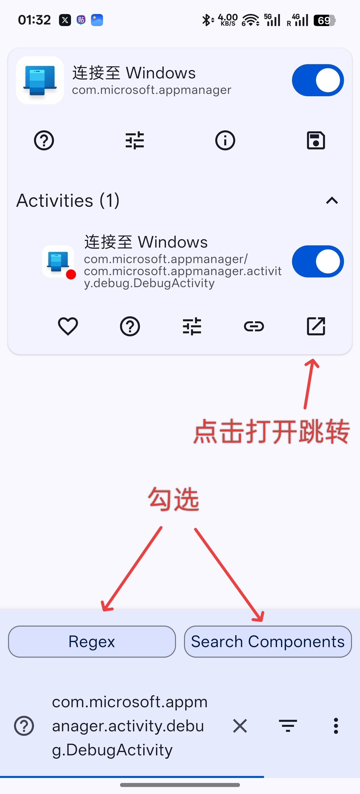
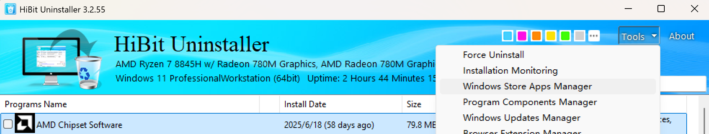
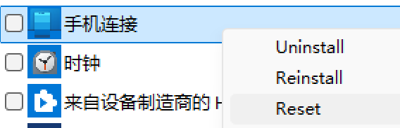

## 移除 Microsoft Phone Link（Android）上的“幽灵”旧设备

本指南说明如何通过 Phone Link 的调试页面，彻底删除 Android 端显示但已无法移除的“旧设备/幽灵设备”。操作完成后，重新绑定账户后这些设备不会再出现。

（原理：在 Phone Link 的 Debug Activity 中可以查看和解除与账户绑定的 peer 客户端信息，逐一 unlink 即可。）

### 适用人群与免责声明
- 需要一定的 Android 使用经验；请谨慎操作。任何非本说明涉及的按钮或选项请勿随意点击，风险自负。
- 对于 Root 用户和非 Root 用户均提供方法。按步骤小心操作即可。

### 快速概览
- 要点：打开 Phone Link 的 Debug Activity -> 使用 "GET PEER CLIENTS INFO" 找到以 `g:` 开头的设备 ID -> 选择并点击 "UNLINK DEVICE" -> 刷新并重复直到列表为空 -> 在 PC 端重置/清理应用数据 -> 在手机端清除数据并重新登录。
- 推荐先在手机与 PC 上确保 Phone Link 的版本一致，避免界面差异导致步骤失效。

### 推荐的版本（本教程对应）
- 手机端 Phone Link: 1.25072.140.0-beta(7030558)（Google Play）
- PC 端 Phone Link: 1.25072.51.0
- PC 上的 Mobile devices: 1.25072.47.0

### 准备工作
1. 如果你有 Root：可使用任意 Activity Launcher 直接启动 Debug Activity（见下面的 Activity 名称）。
2. 如果没有 Root：安装并启用 Shizuku，并安装支持 Shizuku 的 Activity Launcher（示例见下）。

常用链接：
- Shizuku: https://shizuku.rikka.app/
- 支持 Shizuku 的 Activity Launcher（示例）: https://appteka.store/app/17er175390

在 Activity Launcher 中搜索并打开：
```
com.microsoft.appmanager.activity.debug.DebugActivity
```

> 成功打开后即可看到 Debug 页面（下图仅为示意，具体 UI 以你当前版本为准）。



---

## 详细步骤

### 一、在 PC 端清理 Phone Link（可选但推荐）
1. 在 Windows 上打开 Phone Link -> Devices，手动删除已列出的设备（如果接口可用）。
2. 下载并运行 HiBit Uninstaller（或任意能管理 Microsoft Store 应用的工具）：https://www.hibitsoft.ir/Uninstaller.html
3. 在 Windows Store Apps Manager 中找到 “Phone Link”和 “Mobile devices” 两个 UWP 应用，右键选择 Reset（重置）。

示例界面：



### 二、在手机端通过 Debug Activity 逐一解除绑定（核心步骤）
1. 打开 Debug Activity，往下找到含有 "GET PEER CLIENTS INFO" / "UNLINK DEVICE" 的区域（见下图）。
    - 注意：界面上按钮的文字可能因版本不同而略有差异，请对应功能操作。
2. 点击 "GET PEER CLIENTS INFO"。短提示（toast）出现后，第一行会显示若干形如 `g:xxxxxxxxxxxxx` 的设备 ID。
3. 使用右侧的下拉菜单选择其中一项，会在下方的灰色信息中看到该设备的名称等信息。
4. 点击 "UNLINK DEVICE" 按钮解除选中设备与账号的绑定。
5. 再次点击 "GET PEER CLIENTS INFO" 刷新列表，重复 2-4 步，直到所有 `g:...` 条目被清空为止。

操作演示：


完成后，返回 PC 端的 Phone Link 首页，已解绑的设备应不再显示：


### 三、收尾（清理并重新绑定）
1. 在 PC 端退出账户（Phone Link -> 账户 -> 登出）。
2. 在 Android 设置 -> 应用 -> Phone Link，清除应用数据。
3. 按常规流程在手机上重新登录并绑定你的 Windows 设备，确认“幽灵设备”不再出现。

## 常见问题与注意
- 请勿点击与本教程无关的 Debug 页面按钮或执行未知操作，可能导致应用异常。
- 如果界面与教程不符，可能是版本差异；建议先将手机和 PC 的 Phone Link 更新到接近的版本再尝试。
- 本方法会直接影响账户与设备的绑定关系，请在明确目标设备后再解除绑定。

## 致谢
感谢社区中愿意研究这类问题的同好。若你能提供更稳妥的非 Root 开启入口或自动化脚本，欢迎 PR。

---

(文档中图片均为作者在示例机上截取的界面，详见仓库中的图片文件)
